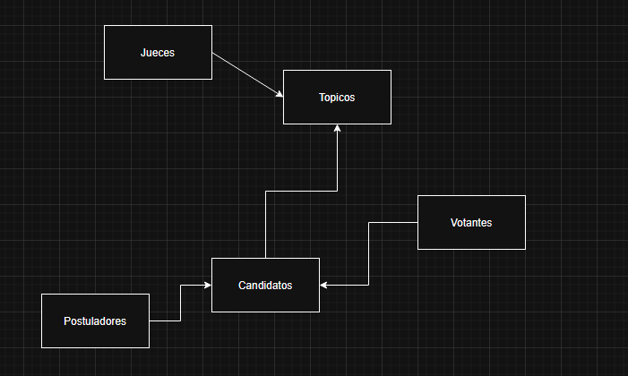
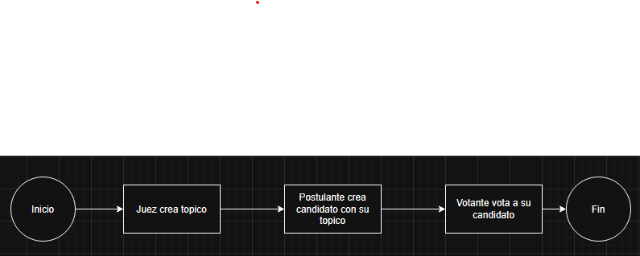

# Your Choose — Votación Descentralizada en Solana

**Your Choose** es un protocolo de votación on-chain construido en Solana usando Rust y el framework Anchor. Permite que cualquier wallet cree un tema de votación, registre candidatos y recolecte un voto verificable por participante — todo aplicado por el propio programa, sin ningún intermediario de confianza.

---

## ¿Qué hace?

El programa administra **Topics** (temas de votación) almacenados en PDAs (Program Derived Addresses) derivadas desde la clave pública del creador. Cada topic contiene una lista de candidatos y un registro de participantes que ya votaron, impidiendo el doble voto a nivel de contrato.

### Operaciones principales (CRUD + PDA)

| Instrucción | ¿Quién puede llamarla? | Descripción |
|---|---|---|
| `create_topic` | Cualquier wallet | Crea un nuevo tema de votación. La cuenta Topic es una PDA derivada de `["topic", owner_pubkey]`. |
| `add_candidate` | Solo el dueño del topic | Agrega un nuevo candidato (nombre, 0 votos, activo) al topic. |
| `get_candidates` | Solo el dueño del topic | Registra en los logs la lista actual de candidatos. |
| `get_participants` | Solo el dueño del topic | Registra en los logs la lista de wallets que ya votaron. |
| `update_candidate_state` | Solo el dueño del topic | Activa o desactiva un candidato (toggle del campo `is_active`). |
| `delete_candidate` | Solo el dueño del topic | Elimina un candidato de la lista permanentemente. |
| `add_vote_to_candidate` | Cualquier wallet | Registra un voto para un candidato. La wallet del votante se agrega a `participants`; intentos posteriores son rechazados. |

---

## Arquitectura

### Entidades on-chain

```
Topic (PDA)
├── owner: Pubkey
├── topic_name: String (máx. 60 caracteres)
├── candidates: Vec<Candidate> (máx. 10)
│   ├── name: String (máx. 60 caracteres)
│   ├── votes: u32
│   └── is_active: bool
└── participants: Vec<Pubkey> (máx. 1000)
```



### Flujo del programa



### Diseño de PDAs

Las cuentas Topic se derivan de forma determinista:

```
seeds = ["topic", owner_pubkey]
```

Esto significa que cada wallet puede ser dueña de exactamente un topic, y la dirección es reproducible desde el cliente sin necesidad de almacenar estado adicional.

---

## Manejo de errores

El programa define tres errores personalizados:

| Error | Cuándo ocurre |
|---|---|
| `YouAreNotOwner` | El llamador intenta modificar un topic que no le pertenece. |
| `CandidateWasNotFind` | El nombre del candidato no existe en la lista del topic. |
| `ErrorInParticipant` | La wallet ya emitió un voto en este topic. |

---

## Program ID

```
BEkiTv1LxUXrfZtQD61Di9MNMzPqRaqBHwcKkdkRrB6A
```

---

## Stack tecnológico

- **Blockchain:** Solana
- **Lenguaje:** Rust
- **Framework:** Anchor
- **Entorno de desarrollo:** Solana Playground

---

## ¿Cómo usarlo?

### 1. Crear un topic

```typescript
await program.methods
  .createTopic("Mejor proyecto Solana 2025")
  .accounts({ owner: wallet.publicKey, topic: topicPda, systemProgram })
  .rpc();
```

### 2. Agregar candidatos

```typescript
await program.methods
  .addCandidate("Alice")
  .accounts({ owner: wallet.publicKey, topic: topicPda, systemProgram })
  .rpc();
```

### 3. Votar

```typescript
await program.methods
  .addVoteToCandidate("Alice")
  .accounts({ owner: voterPublicKey, topic: topicPda, systemProgram })
  .rpc();
```

### 4. Gestionar candidatos (solo el dueño)

```typescript
// Activar o desactivar
await program.methods.updateCandidateState("Alice").accounts({...}).rpc();

// Eliminar permanentemente
await program.methods.deleteCandidate("Alice").accounts({...}).rpc();
```

---

## Seguridad

- **Control de propiedad:** Todas las operaciones de escritura verifican que `topic.owner == caller`, retornando `YouAreNotOwner` en caso contrario.
- **Un voto por wallet:** Antes de registrar un voto, el programa revisa el vector `participants`; los votantes duplicados son rechazados on-chain.
- **Cuentas basadas en PDAs:** Las cuentas Topic están controladas por el programa, no por ninguna wallet externa, haciendo imposibles las escrituras no autorizadas.
